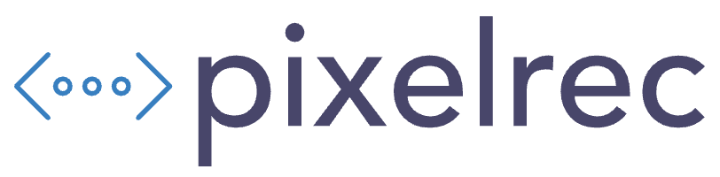

# 🎬 PixelRec - Professional Screen Recording Platform

<div align="center">
  
  
  **A modern, feature-rich screen recording application built with Next.js**
  
  [](https://nextjs.org/)
  [](https://reactjs.org/)
  [](https://www.typescriptlang.org/)
  [](https://tailwindcss.com/)
  [](https://remotion.dev/)
</div>

## ✨ Features

### 🎥 **Recording Capabilities**
- **High-Quality Screen Capture** - Record in up to 1920x1080 resolution at 30fps
- **Audio Support** - Capture system audio and microphone simultaneously
- **Flexible Recording Options** - Full screen, window, or tab recording
- **Real-time Duration Tracking** - Live recording timer and duration display

### ✂️ **Advanced Video Editing**
- **Trim & Cut Tools** - Precise start/end time controls with intuitive sliders
- **Video Preview** - Real-time preview powered by Remotion player
- **Duration Management** - Automatic calculation of trimmed video length
- **Custom Styling** - Beautiful UI with custom slider controls

### 🔐 **User Authentication**
- **Google OAuth Integration** - Secure login with Better Auth
- **Session Management** - Persistent user sessions
- **Protected Routes** - Middleware-based route protection
- **User Profiles** - Avatar and profile information display

### 📱 **Modern UI/UX**
- **Responsive Design** - Works perfectly on desktop, tablet, and mobile
- **Dark/Light Themes** - Elegant design with modern aesthetics
- **Interactive Components** - Smooth animations and hover effects
- **Toast Notifications** - User-friendly feedback system
- **Modal System** - Clean modal interfaces for login and recording

### 🗂️ **Video Management**
- **Gallery View** - Beautiful grid layout for all recordings
- **Video Metadata** - Title, description, duration, and visibility settings
- **Share Functionality** - One-click link copying for easy sharing
- **Privacy Controls** - Public/private visibility options
- **User Attribution** - Creator information display

### 🚀 **Performance & Optimization**
- **Server-Side Rendering** - Fast initial page loads with Next.js
- **Static Site Generation** - Optimized build for better performance
- **Image Optimization** - Automatic image compression and loading
- **Code Splitting** - Lazy loading for optimal bundle sizes

## 🛠️ Tech Stack

### **Frontend**
- **Framework:** Next.js 15.3.3 with App Router
- **UI Library:** React 19.0.0
- **Styling:** Tailwind CSS 4.0
- **Icons:** Lucide React + React Icons
- **Video Player:** Remotion 4.0.314
- **State Management:** React Hooks

### **Backend & Database**
- **Database:** Xata (PostgreSQL-based)
- **ORM:** Drizzle ORM
- **Authentication:** Better Auth
- **File Storage:** Supabase Storage
- **API:** Next.js API Routes

### **Development Tools**
- **Language:** TypeScript
- **Linting:** ESLint with Next.js config
- **Build Tool:** Next.js with Turbopack
- **Package Manager:** npm

## 🚀 Getting Started

### Prerequisites
- Node.js 18+ installed
- npm or yarn package manager
- Git for version control

### Installation

1. **Clone the repository**
   ```bash
   git clone https://github.com/yourusername/pixelrec.git
   cd pixelrec
   ```

2. **Install dependencies**
   ```bash
   npm install
   ```

3. **Environment Setup**
   Create a `.env.local` file in the root directory:
   ```env
   # Database
   XATA_API_KEY=your_xata_api_key
   XATA_BRANCH=main
   
   # Authentication
   BETTER_AUTH_SECRET=your_auth_secret
   GOOGLE_CLIENT_ID=your_google_client_id
   GOOGLE_CLIENT_SECRET=your_google_client_secret
   
   # Storage
   NEXT_PUBLIC_SUPABASE_URL=your_supabase_url
   NEXT_PUBLIC_SUPABASE_ANON_KEY=your_supabase_anon_key
   SUPABASE_SERVICE_ROLE_KEY=your_service_role_key
   
   # App
   NEXT_PUBLIC_APP_URL=http://localhost:3000
   ```

4. **Database Setup**
   ```bash
   # Run database migrations
   npm run db:migrate
   
   # Generate database types
   npm run db:generate
   ```

5. **Start the development server**
   ```bash
   npm run dev
   ```

6. **Open your browser**
   Navigate to [http://localhost:3000](http://localhost:3000)

## 📁 Project Structure

```
pixelrec/
├── app/                    # Next.js App Router
│   ├── (root)/            # Main application routes
│   │   ├── edit/          # Video editing pages
│   │   ├── gallery/       # Video gallery
│   │   ├── watch/         # Video viewing
│   │   └── page.tsx       # Homepage
│   ├── api/               # API routes
│   └── layout.tsx         # Root layout
├── components/            # Reusable UI components
│   ├── ui/               # Base UI components
│   ├── FeatureCard.tsx   # Feature display cards
│   ├── VideoThumbnail.tsx # Video preview cards
│   └── ...
├── lib/                  # Utility libraries
│   ├── auth.ts          # Authentication config
│   ├── supabase.ts      # Supabase client
│   └── hooks/           # Custom React hooks
├── actions/             # Server actions
├── drizzle/            # Database schema & config
├── constants/          # App constants
├── remotion/           # Remotion compositions
└── public/             # Static assets
```

## 🎯 Key Features Walkthrough

### Recording a Video
1. Click "Record Video" on the homepage or gallery
2. Grant screen recording permissions
3. Select your screen/window/tab to record
4. Start recording with the record button
5. Stop when finished and preview your recording

### Editing Your Recording
1. After recording, you'll be redirected to the edit page
2. Add a title and description
3. Use the trim controls to cut your video
4. Set visibility (public/private)
5. Upload and share your video

### Sharing Videos
1. Navigate to the gallery to see all videos
2. Hover over any video card
3. Click the copy icon to copy the share link
4. Share the link with anyone

## 🔧 Available Scripts

```bash
# Development
npm run dev          # Start development server
npm run build        # Build for production
npm run start        # Start production server
npm run lint         # Run ESLint

# Database
npm run db:generate  # Generate database types
npm run db:migrate   # Run database migrations
npm run db:studio    # Open database studio
```

## 🌐 Deployment

### Vercel (Recommended)
1. Push your code to GitHub
2. Connect your repository to Vercel
3. Add environment variables in Vercel dashboard
4. Deploy automatically on every push

### Other Platforms
The app can be deployed on any platform that supports Next.js:
- Netlify
- Railway
- AWS Amplify
- DigitalOcean App Platform

## 🤝 Contributing

1. Fork the repository
2. Create a feature branch (`git checkout -b feature/amazing-feature`)
3. Commit your changes (`git commit -m 'Add amazing feature'`)
4. Push to the branch (`git push origin feature/amazing-feature`)
5. Open a Pull Request

## 📝 License

This project is licensed under the MIT License - see the [LICENSE](LICENSE) file for details.

## 🙏 Acknowledgments

- [Next.js](https://nextjs.org/) for the amazing React framework
- [Remotion](https://remotion.dev/) for powerful video rendering
- [Tailwind CSS](https://tailwindcss.com/) for utility-first styling
- [Lucide](https://lucide.dev/) for beautiful icons
- [Supabase](https://supabase.io/) for backend services
- [Xata](https://xata.io/) for the database platform

## 📞 Support

If you have any questions or run into issues:
- Open an issue on GitHub
- Check the documentation
- Join our community discussions

---

<div align="center">
  Made with ❤️ using Next.js and modern web technologies
</div>
